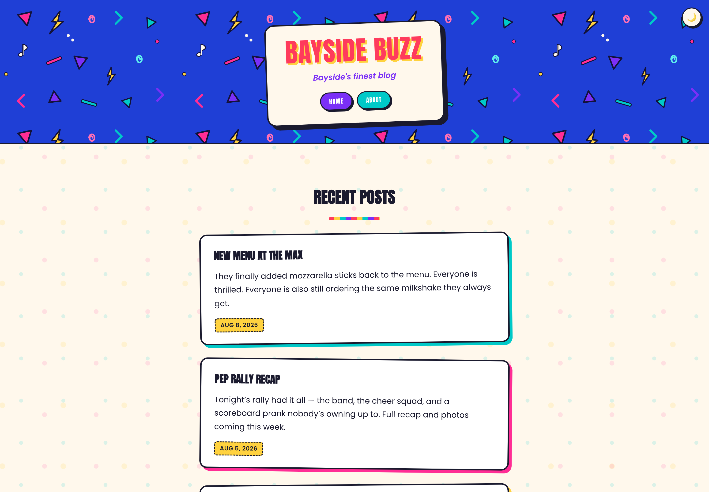

# Saved by the Blog

A bold, color-blocked [Micro.blog](https://micro.blog) theme inspired by early-90s teen sitcom title cards — chunky poster type, locker-sticker cards with hard drop shadows, hall-pass date stamps, and a bright Bayside-style palette.

This is an original design *inspired by* the aesthetic of the era (color-blocking, geometric stripes, varsity type) — no show logos, characters, or trademarked artwork are included.

## Screenshot



## Features

* Poster-style masthead with a diagonal color-stripe background and a rotated "taped-on" title card
* Post list rendered as stacked, slightly-rotated sticker cards, each with a different accent color and hard offset shadow
* Hall-pass–style date badges and pill-shaped category tags
* Squiggly link underlines, comic-style blockquotes, and a striped `<hr>` to match the masthead
* Full support for Micro.blog conversation/reply plugins ([Reply by Email](https://github.com/sod/plugin-reply-by-email), [Conversation on Micro.blog](https://github.com/svendahlstrand/plugin-conversation-on-mb)), IndieAuth/Micropub/Webmention endpoints, RSS/JSON/podcast feeds, and the `plugins_css` / `plugins_js` / `plugins_html` hooks
* Automatic dark mode ("Bayside after dark") via `prefers-color-scheme`, plus a manual sun/moon toggle in the masthead (remembered per-visitor via `localStorage`)
* Styled **Archive** (`/archive/`) and **Photos** (`/photos/`) pages — a compact, year-grouped list and a Polaroid-style photo grid — linked from the footer
* Post excerpts via a custom `<!--excerpt-->...<!--more-->` tag, same convention used by other Micro.blog themes
* "Older"/"Newer" post navigation at the bottom of each post, styled as a pair of locker-sticker cards
* A "back to top" button that fades in once you've scrolled, matching the masthead's dark-mode toggle
* Favicon and apple-touch-icon, sourced automatically from your Micro.blog avatar

## SEO

* Per-page `<meta name="description">`, Open Graph, and Twitter Card tags — each post uses its own summary (or a `description` front matter field), not a repeated site-wide description
* Open Graph/Twitter image and `schema.org` `image` prefer a post's own photo (`photos`/`images` front matter) over the site avatar
* Self-referencing `<link rel="canonical">` on every page
* Enriched `schema.org` `BlogPosting` microdata on posts (`image`, `author`, `publisher`, `mainEntityOfPage`, `dateModified`), on top of the existing `h-entry` microformats
* A single `<h1>` per page (the page/post title — the site name in the masthead is a logo link, not a heading), and in-content Markdown headings (`##`, `###`) get real hierarchy and styling instead of falling back to unstyled browser defaults
* RSS/JSON feeds, sitemap, and `robots.txt` come from Micro.blog's platform-level templates, not this theme — they're included automatically regardless of theme

## Theme options

Configurable from the plugin's settings screen on Micro.blog (or directly as `params.*` in `config.json`):

* **Subtitle** / **Description** — `params.subtitle`, `params.description`
* **Posts per page** — `params.posts_per_page` (defaults to 10)
* **Custom `<head>` code** — `params.custom_head_html`, raw HTML/meta tags/tracking scripts inserted before `</head>`
* **Custom footer code** — `params.custom_footer`, Markdown (raw HTML allowed) inserted at the end of the footer. Uses the same param as Micro.blog's official [Custom footer](https://github.com/microdotblog/plugin-footer) plugin, so the two are interchangeable.
* **Show full posts** — `params.show_full_posts`, boolean, defaults to off. When on, the home/archive/category lists show the complete post instead of a "Keep reading" excerpt for long posts. A manual `<!--more-->` cut, or the `<!--excerpt-->` tag below, always wins regardless of this setting — it's only for automatic truncation.

## Customizing colors

All the theme's colors live as CSS custom properties near the top of `static/css/style.css`:

```css
:root {
  --color-red: #ff3b5c;
  --color-pink: #ff2d95;
  --color-purple: #7b2ff7;
  --color-teal: #00c9c8;
  --color-yellow: #ffd23f;

  --bg: #fff8ec;      /* page background */
  --surface: #ffffff; /* card/panel background */
  --text: #1a1a2e;    /* body text + comic-style outlines */
}
```

Change these (or override them from your blog's Custom CSS field) to retheme the accent palette without touching any markup.

## Installing on Micro.blog

1. In your Micro.blog design settings, set the built-in template to **Blank** and remove any other theme plugins.
2. Install this theme as a plugin (point Micro.blog at this GitHub repo).
3. Once installed, set your **Subtitle** and **Description** from the plugin's settings screen — these map to `params.subtitle` and `params.description` in `config.json`.

## Local development

This is a standard [Hugo](https://gohugo.io) theme, structured the way Micro.blog expects (`theme.toml`, `config.json`, `plugin.json`, `layouts/`, `static/`). To preview locally, drop this repo into `themes/savedbytheblog` inside a Hugo site and run:

```sh
hugo server -t savedbytheblog
```

## License

MIT — see [LICENSE.md](LICENSE.md).
